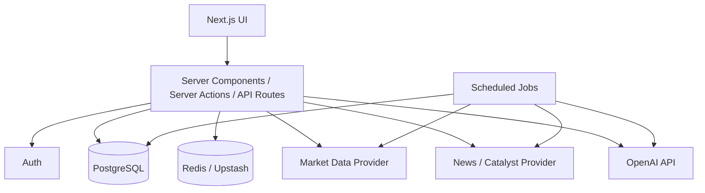
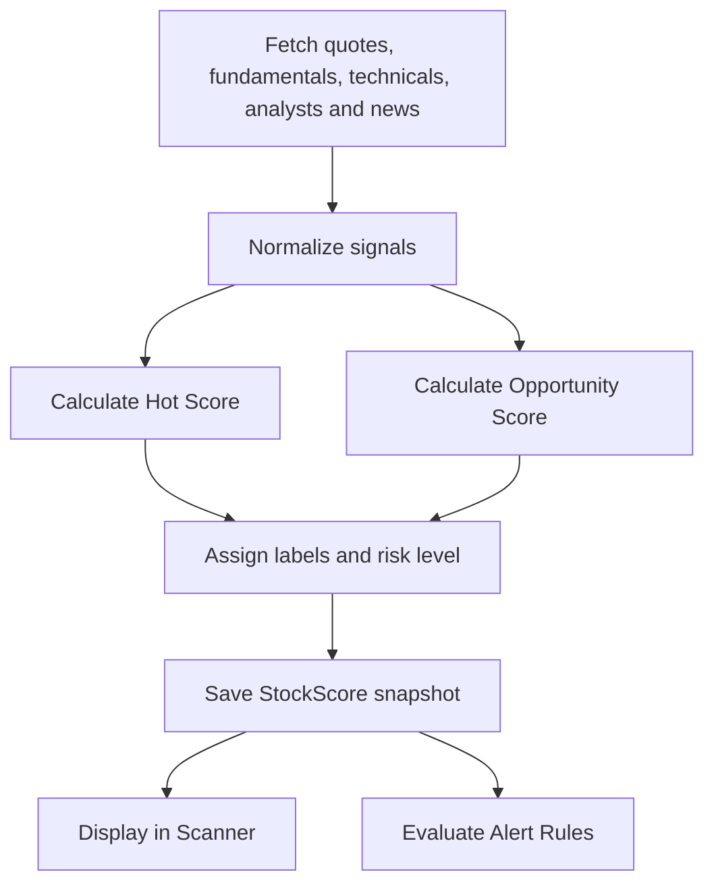
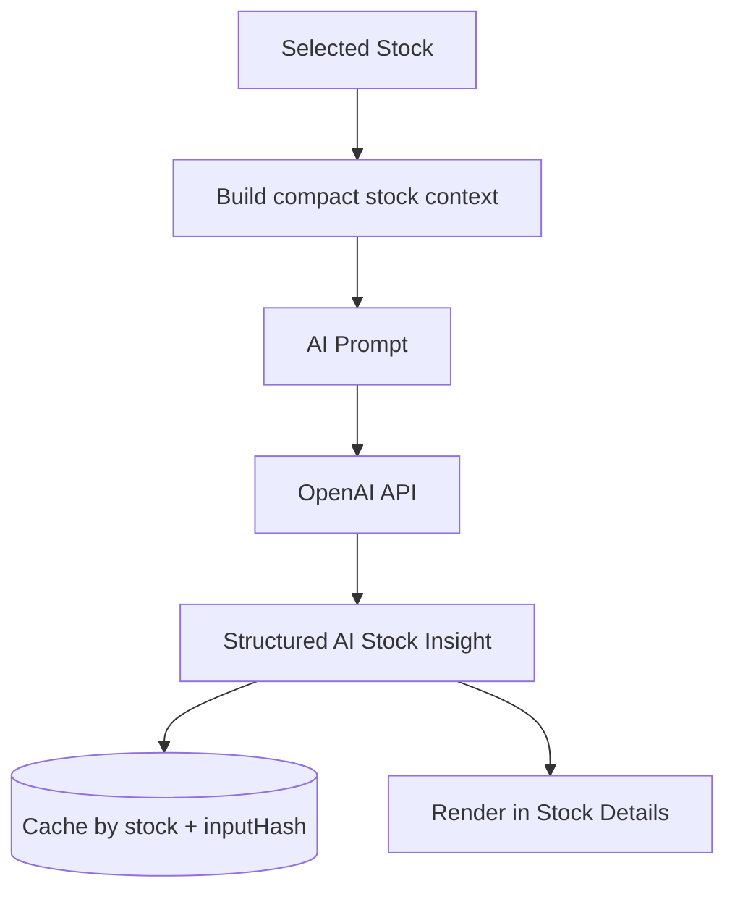
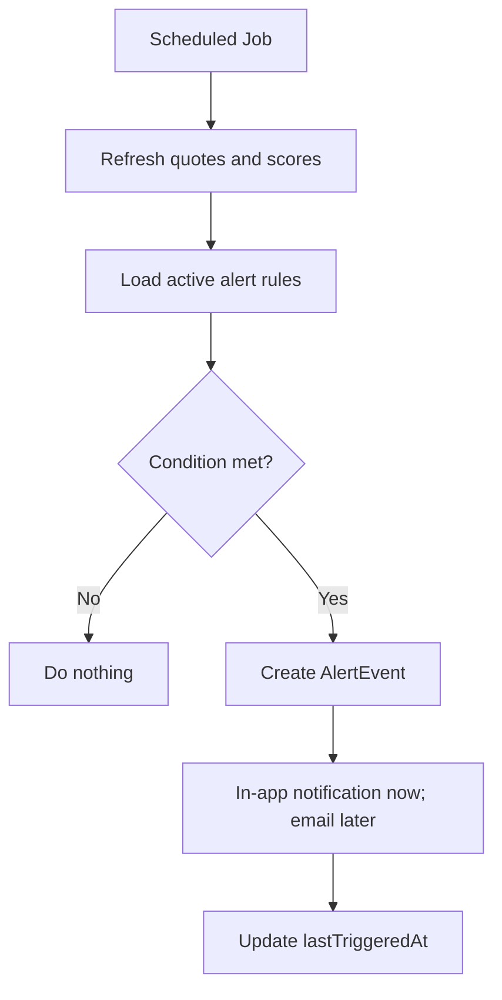

# FomoFilter Project Overview

🚀 **AI-powered hot stock discovery & tracking platform** for finding market movers, filtering hype, and building a disciplined watchlist.

> This file gives AI coding agents the **product and architecture context** only.  
> Coding rules belong in `coding-standards.md`.  
> AI workflow rules belong in `ai-interaction.md`.  
> Active implementation details belong in `current-feature.md`.

---

## 1. Product Identity

| Field | Value |
| --- | --- |
| Working name | **FomoFilter** |
| Product type | AI stock discovery, scanner, watchlist and alert platform |
| Main users | Active retail investors, swing traders, growth investors, high-risk/high-reward investors |
| Core promise | **Find hot stocks before they become obvious — and understand whether the move is real or just FOMO.** |
| MVP focus | Scanner, scoring, stock details, watchlist, basic alerts, AI summaries |

### Core Value

Most stock screeners answer:

> What is moving?

FomoFilter should answer:

> What is moving, why is it moving, and is it still worth tracking?

---

## 2. Product Boundary

FomoFilter is a **research and decision-support tool**, not a financial advisor.

Avoid language like:

- “Buy this stock now”
- “Guaranteed upside”
- “Safe investment”
- “This will go up”

Use cautious language:

- “Worth tracking”
- “Potential opportunity”
- “High-risk setup”
- “Momentum signal”
- “Analyst upside remains attractive”
- “Requires further validation”

---

## 3. Target Users

| Persona | Needs | Main App Value |
| --- | --- | --- |
| Active Retail Investor | Daily ideas, upside, quick research | Ranked opportunity lists and AI summaries |
| Swing Trader | Momentum, volume, breakouts, pullbacks | Hot Score, technical signals and alerts |
| High-Risk Investor | Speculative opportunities with catalysts | Risk labels, catalyst tracking and hype filtering |
| Growth Investor | Strong companies with fundamentals | Opportunity Score and fundamental quality signals |
| AI-First Investor | Fast insight generation | AI summaries, bull/bear case and catalyst explanation |

---

## 4. MVP Scope

### MVP Must Have

1. **Hot Stocks Scanner**
   - Search by ticker/company
   - Sort and filter stocks
   - Show Hot Score and Opportunity Score

2. **Stock Details Page**
   - Price and key stats
   - Scores
   - Analyst view
   - Fundamentals
   - Technical setup
   - News/catalyst summary
   - AI stock summary

3. **Watchlist**
   - Add/remove stocks
   - Track reason, entry zone, target, stop loss, notes and status

4. **Basic Alerts**
   - Price thresholds
   - Daily change threshold
   - Relative volume threshold
   - Hot Score / Opportunity Score threshold

5. **AI Summary**
   - Explain what is happening
   - Why the stock is moving
   - Bull case
   - Bear case
   - What to watch next
   - Risk explanation

### Not in MVP

- Native mobile app
- Brokerage connection
- Real trading execution
- Options flow
- Crypto
- Social/community features
- Advanced backtesting
- Complex team permissions
- Fully automated investment recommendations

---

## 5. Core Screens

| Screen | Route | Purpose |
| --- | --- | --- |
| Dashboard | `/dashboard` | Daily market overview |
| Scanner | `/scanner` | Main stock discovery workspace |
| Stock Details | `/stocks/[symbol]` | Deep research page for one stock |
| Watchlist | `/watchlist` | User-tracked stocks with notes and status |
| Alerts | `/alerts` | Alert rules and triggered events |
| Settings | `/settings` | Account, preferences and API/data settings |

### Suggested Navigation Icons

| Label | Lucide Icon |
| --- | --- |
| Dashboard | `LayoutDashboard` |
| Scanner | `Radar` |
| Watchlist | `Star` |
| Alerts | `Bell` |
| Stocks | `LineChart` |
| AI Insights | `Sparkles` |
| Settings | `Settings` |

---

## 6. Core Product Features

### A) Hot Stocks Scanner

The primary discovery screen. It ranks stocks using market activity, momentum, volume, analyst upside, catalysts and quality signals.

**Initial table columns:**

- Ticker
- Company name
- Sector / Industry
- Current price
- Daily / weekly / monthly change %
- Market cap
- Volume
- Relative volume
- Analyst target price
- Analyst upside %
- Analyst rating
- Hot Score
- Opportunity Score
- Risk Level
- Last catalyst
- Watchlist status

**Prebuilt scanner views:**

| View | Icon | Purpose |
| --- | --- | --- |
| Hot Today | 🔥 | Highest current activity |
| Strong Momentum | 📈 | Stocks with strong short-term trend |
| Best Opportunities | 🎯 | Strong risk/reward based on scoring |
| Unusual Volume | 🌋 | Relative volume spikes |
| Earnings Crash Watch | 📉 | Possible overreactions after earnings |
| Breakout Candidates | 🚀 | Technical breakout setups |
| Oversold Opportunities | 🧊 | Pullbacks with possible upside |
| Analyst Favorites | 🧠 | Strong analyst support |
| High Risk / High Reward | ⚡ | Speculative movers |
| Quality Growth Stocks | 💎 | Growth + quality |
| Cheap Growth Stocks | 💰 | Growth with reasonable valuation |

---

## 7. Scoring System

### Hot Score

A 0–100 score that answers:

> How hot is this stock right now?

| Signal Group | Weight | Meaning |
| --- | ---: | --- |
| Momentum | 25% | Daily, weekly and monthly price movement |
| Volume Heat | 20% | Volume compared to historical average |
| News / Catalyst | 20% | Earnings, upgrades, contracts, sector news, unusual events |
| Analyst Upside | 15% | Gap between current price and analyst target |
| Fundamentals | 10% | Growth, margins, profitability, debt and valuation |
| Technical Setup | 10% | RSI, moving averages, breakout/pullback patterns |

### Opportunity Score

A 0–100 score that answers:

> Is this still an attractive opportunity, or is it already too stretched?

| Signal Group | Weight | Meaning |
| --- | ---: | --- |
| Analyst Upside | 25% | Potential upside to consensus target |
| Fundamental Quality | 25% | Growth, margins, ROE, balance sheet |
| Valuation | 20% | Forward P/E, PEG, valuation vs growth |
| Technical Entry Quality | 15% | Not too overextended, healthy pullback, support zone |
| Catalyst Strength | 10% | Real event behind the move |
| Risk Adjustment | 5% | Penalizes extreme volatility, weak fundamentals or unclear catalyst |

### Score Labels

| Score | Label |
| ---: | --- |
| 85–100 | Extremely Hot / Strong Opportunity |
| 70–84 | Hot / Attractive |
| 55–69 | Warming Up / Watch |
| 40–54 | Neutral |
| 0–39 | Weak / Cold |

### MVP Scoring Shortcut

For the first version, use a simpler scoring model:

- Momentum Score
- Relative Volume Score
- Analyst Upside Score
- Fundamental Quality Score
- Technical Setup Score

Add catalyst/news scoring after the first stable scanner version.

---

## 8. Data Model Overview

### Main Entities

| Entity | Purpose |
| --- | --- |
| User | Account, plan, preferences |
| Stock | Core stock identity |
| StockQuote | Latest price and movement snapshot |
| StockMetric | Fundamental and valuation data |
| StockTechnical | Technical indicators |
| AnalystSnapshot | Analyst rating, target and upside |
| NewsItem | News and catalyst data |
| AiStockInsight | AI-generated summary and bull/bear case |
| StockScore | Calculated Hot Score and Opportunity Score |
| Watchlist | User watchlist container |
| WatchlistItem | User-specific tracking context for a stock |
| AlertRule | User alert configuration |
| AlertEvent | Triggered alert history |
| ScannerView | Saved filters and prebuilt scanner views |
| DataProviderSyncLog | Sync status for market data jobs |

### Prisma Draft

```prisma
enum Plan {
  FREE
  PRO
}

enum RiskLevel {
  LOW
  MEDIUM
  HIGH
  EXTREME
}

enum WatchStatus {
  WATCHING
  WAITING_FOR_PULLBACK
  READY_TO_BUY
  HOLDING
  AVOIDING
  ARCHIVED
}

enum AlertType {
  PRICE_ABOVE
  PRICE_BELOW
  DAILY_CHANGE_ABOVE
  DAILY_CHANGE_BELOW
  RELATIVE_VOLUME_ABOVE
  HOT_SCORE_ABOVE
  OPPORTUNITY_SCORE_ABOVE
  ANALYST_TARGET_CHANGED
  ANALYST_RATING_CHANGED
  NEW_CATALYST
  EARNINGS_APPROACHING
}

enum AlertFrequency {
  ONCE
  DAILY
  ALWAYS
}

model User {
  id                   String   @id @default(cuid())
  email                String   @unique
  name                 String?
  image                String?
  passwordHash         String?
  plan                 Plan     @default(FREE)
  stripeCustomerId     String?
  stripeSubscriptionId String?
  preferredCurrency    String   @default("USD")
  timezone             String   @default("Asia/Jerusalem")
  createdAt            DateTime @default(now())
  updatedAt            DateTime @updatedAt

  watchlists           Watchlist[]
  alertRules           AlertRule[]
  scannerViews         ScannerView[]
}

model Stock {
  id              String   @id @default(cuid())
  symbol          String   @unique
  name            String
  exchange        String?
  sector          String?
  industry        String?
  country         String?
  currency        String   @default("USD")
  marketCap       Decimal?
  website         String?
  description     String?
  isActive        Boolean  @default(true)
  createdAt       DateTime @default(now())
  updatedAt       DateTime @updatedAt

  quotes           StockQuote[]
  metrics          StockMetric[]
  technicals       StockTechnical[]
  analystSnapshots AnalystSnapshot[]
  newsItems        NewsItem[]
  aiInsights       AiStockInsight[]
  scores           StockScore[]
  watchlistItems   WatchlistItem[]
  alertRules       AlertRule[]

  @@index([symbol])
  @@index([sector])
  @@index([industry])
}

model StockQuote {
  id                         String   @id @default(cuid())
  stockId                    String
  stock                      Stock    @relation(fields: [stockId], references: [id], onDelete: Cascade)

  price                      Decimal
  previousClose              Decimal?
  open                       Decimal?
  dayHigh                    Decimal?
  dayLow                     Decimal?
  volume                     BigInt?
  avgVolume                  BigInt?
  relativeVolume             Decimal?
  changePercent              Decimal?
  weekChangePercent          Decimal?
  monthChangePercent         Decimal?
  fiftyTwoWeekHigh           Decimal?
  fiftyTwoWeekLow            Decimal?
  distanceFrom52wHighPercent Decimal?
  distanceFrom52wLowPercent  Decimal?
  capturedAt                 DateTime @default(now())

  @@index([stockId, capturedAt])
  @@index([capturedAt])
}

model StockMetric {
  id               String   @id @default(cuid())
  stockId          String
  stock            Stock    @relation(fields: [stockId], references: [id], onDelete: Cascade)

  revenueGrowthYoY Decimal?
  epsGrowthYoY     Decimal?
  roe              Decimal?
  grossMargin      Decimal?
  operatingMargin  Decimal?
  netMargin        Decimal?
  debtToEquity     Decimal?
  currentRatio     Decimal?
  forwardPe        Decimal?
  pegRatio         Decimal?
  freeCashFlow     Decimal?
  fiscalPeriod     String?
  fiscalYear       Int?
  source           String?
  capturedAt       DateTime @default(now())

  @@index([stockId, capturedAt])
}

model StockTechnical {
  id                 String   @id @default(cuid())
  stockId            String
  stock              Stock    @relation(fields: [stockId], references: [id], onDelete: Cascade)

  rsi14              Decimal?
  sma20              Decimal?
  sma50              Decimal?
  sma200             Decimal?
  priceVsSma50Pct    Decimal?
  priceVsSma200Pct   Decimal?
  trendLabel         String?
  supportLevel       Decimal?
  resistanceLevel    Decimal?
  breakoutSignal     Boolean  @default(false)
  capturedAt         DateTime @default(now())

  @@index([stockId, capturedAt])
}

model AnalystSnapshot {
  id              String   @id @default(cuid())
  stockId         String
  stock           Stock    @relation(fields: [stockId], references: [id], onDelete: Cascade)

  consensusRating String?
  targetPrice     Decimal?
  upsidePercent   Decimal?
  strongBuyCount  Int?
  buyCount        Int?
  holdCount       Int?
  sellCount       Int?
  strongSellCount Int?
  source          String?
  capturedAt      DateTime @default(now())

  @@index([stockId, capturedAt])
}

model NewsItem {
  id              String   @id @default(cuid())
  stockId         String
  stock           Stock    @relation(fields: [stockId], references: [id], onDelete: Cascade)

  title           String
  summary         String?
  url             String
  source          String?
  publishedAt     DateTime?
  sentiment       Decimal?
  catalystType    String?
  isMajorCatalyst Boolean  @default(false)
  createdAt       DateTime @default(now())

  @@unique([url])
  @@index([stockId, publishedAt])
}

model AiStockInsight {
  id              String   @id @default(cuid())
  stockId         String
  stock           Stock    @relation(fields: [stockId], references: [id], onDelete: Cascade)

  summary         String
  whyMoving       String?
  bullCase        String?
  bearCase        String?
  whatToWatch     String?
  riskExplanation String?
  model           String?
  inputHash       String?
  createdAt       DateTime @default(now())

  @@index([stockId, createdAt])
}

model StockScore {
  id                String    @id @default(cuid())
  stockId           String
  stock             Stock     @relation(fields: [stockId], references: [id], onDelete: Cascade)

  hotScore          Int
  opportunityScore  Int
  riskLevel         RiskLevel
  momentumScore     Int?
  volumeScore       Int?
  catalystScore     Int?
  analystScore      Int?
  fundamentalsScore Int?
  technicalScore    Int?
  valuationScore    Int?
  explanation       String?
  calculatedAt      DateTime @default(now())

  @@index([stockId, calculatedAt])
  @@index([hotScore])
  @@index([opportunityScore])
}

model Watchlist {
  id          String   @id @default(cuid())
  userId      String
  user        User     @relation(fields: [userId], references: [id], onDelete: Cascade)

  name        String
  description String?
  isDefault   Boolean  @default(false)
  createdAt   DateTime @default(now())
  updatedAt   DateTime @updatedAt

  items       WatchlistItem[]

  @@index([userId])
}

model WatchlistItem {
  id             String      @id @default(cuid())
  watchlistId    String
  watchlist      Watchlist   @relation(fields: [watchlistId], references: [id], onDelete: Cascade)
  stockId        String
  stock          Stock       @relation(fields: [stockId], references: [id], onDelete: Cascade)

  status         WatchStatus @default(WATCHING)
  reason         String?
  entryZoneLow   Decimal?
  entryZoneHigh  Decimal?
  personalTarget Decimal?
  stopLoss       Decimal?
  confidence     Int?
  timeframe      String?
  notes          String?
  createdAt      DateTime @default(now())
  updatedAt      DateTime @updatedAt

  @@unique([watchlistId, stockId])
  @@index([stockId])
}

model AlertRule {
  id              String         @id @default(cuid())
  userId          String
  user            User           @relation(fields: [userId], references: [id], onDelete: Cascade)
  stockId         String
  stock           Stock          @relation(fields: [stockId], references: [id], onDelete: Cascade)

  type            AlertType
  threshold       Decimal?
  frequency       AlertFrequency @default(ONCE)
  isActive        Boolean        @default(true)
  lastTriggeredAt DateTime?
  createdAt       DateTime       @default(now())
  updatedAt       DateTime       @updatedAt

  events          AlertEvent[]

  @@index([userId])
  @@index([stockId])
  @@index([isActive])
}

model AlertEvent {
  id          String    @id @default(cuid())
  alertRuleId String
  alertRule   AlertRule @relation(fields: [alertRuleId], references: [id], onDelete: Cascade)

  message     String
  value       Decimal?
  triggeredAt DateTime @default(now())
  isRead      Boolean  @default(false)

  @@index([alertRuleId, triggeredAt])
}

model ScannerView {
  id          String   @id @default(cuid())
  userId      String?
  user        User?    @relation(fields: [userId], references: [id], onDelete: Cascade)

  name        String
  slug        String
  description String?
  icon        String?
  isSystem    Boolean  @default(false)
  filtersJson Json
  sortJson    Json?
  createdAt   DateTime @default(now())
  updatedAt   DateTime @updatedAt

  @@unique([userId, slug])
}

model DataProviderSyncLog {
  id             String   @id @default(cuid())
  provider       String
  syncType       String
  status         String
  message        String?
  startedAt      DateTime @default(now())
  finishedAt     DateTime?
  recordsFetched Int?
  recordsUpdated Int?

  @@index([provider, syncType, startedAt])
}
```

---

## 9. Architecture Diagrams

### System Architecture



### Scoring Flow



### AI Insight Flow



### Alert Flow



---

## 10. Recommended Tech Stack

| Category | Choice |
| --- | --- |
| Framework | Next.js 16 / React 19 |
| Language | TypeScript |
| UI | Tailwind CSS v4 + ShadCN UI |
| Icons | Lucide React |
| Charts | Recharts for MVP; lightweight-charts later |
| Database | PostgreSQL / Neon |
| ORM | Prisma |
| Auth | Better Auth or NextAuth |
| AI | OpenAI API |
| Market Data | Twelve Data / FMP / Polygon / Finnhub |
| Jobs | Inngest / Trigger.dev / Vercel Cron |
| Cache | Redis / Upstash |
| Payments | Stripe |
| Deployment | Vercel |
| Monitoring | Sentry later |

> Exact coding standards are defined in `coding-standards.md`.

---

## 11. Suggested Modules

| Module | Responsibility |
| --- | --- |
| `market-data/provider.ts` | Common interface for all market data providers |
| `market-data/twelve-data.ts` | Twelve Data implementation |
| `scoring/hot-score.ts` | Hot Score calculation |
| `scoring/opportunity-score.ts` | Opportunity Score calculation |
| `scoring/risk-level.ts` | Risk label and penalty logic |
| `ai/build-stock-context.ts` | Converts stock data into compact AI context |
| `ai/generate-stock-insight.ts` | Generates and caches AI summary |
| `alerts/evaluate-alert-rules.ts` | Checks alert conditions after refresh |
| `scanner/apply-filters.ts` | Applies scanner filters |
| `scanner/system-views.ts` | Defines built-in scanner views |

---

## 12. UI / UX Direction

### Product Feel

- Dark mode first
- Clean financial dashboard style
- Fast table interactions
- Clear scoring labels
- Minimal but data-rich
- Inspired by Linear, TradingView, Finviz and AI assistant workflows

### Suggested Colors

| Concept | Color |
| --- | --- |
| Hot / Momentum | Orange / Red |
| Opportunity | Emerald / Green |
| Warning / Risk | Amber |
| Neutral | Slate / Gray |
| AI Insight | Purple |
| Analyst | Blue |

### Suggested Feature Icons

| Concept | Lucide Icon |
| --- | --- |
| Hot Score | `Flame` |
| Opportunity Score | `Target` |
| Alerts | `Bell` |
| Watchlist | `Star` |
| News Catalyst | `Newspaper` |
| Technicals | `Activity` |
| Fundamentals | `BarChart3` |
| Analyst View | `BadgeDollarSign` |
| AI Summary | `Sparkles` |
| Risk | `TriangleAlert` |

### Screenshots

Refer to the screenshots below as a base for the dashboard UI. it does not have to be exact. Use it as a reference:

- [Top Main screen](screenshots/Main-screen-Top.png)
- [Bottom Main screen](screenshots/Main-screen-bottom.png)
- [Bottom End Main screen](screenshots/Main-screen-bottom-2.png!)
- [Hot stock table click - open right panel with information](screenshots/Hot-stocks-click-open-right-pannel.png)
- [Hot stock table click - open right panel with information - bottom](screenshots/Hot-stocks-click-open-right-pannel-bottom.png)
- [Hot stock table click - open right panel with information - bottom end](screenshots/Hot-stocks-click-open-right-pannel-bottom-2.png)
- [Hot stock table click - open right panel with information - click on add to watchlist](screenshots/Hot-stocks-click-open-right-pannel-adding-to-watchlist.png)
- [Hot stock table click - open right panel with information - click on add alert](screenshots/Hot-stocks-click-open-right-pannel-adding-alert.png)

---

## 13. Monetization Direction

### Free Plan

- Limited watchlist items
- Limited scanner results
- Basic Hot Score
- Basic Opportunity Score
- Basic stock details
- Limited alerts
- Limited AI summaries per month

### Pro Plan

Suggested price:

- $9/month
- $90/year

Pro features:

- Unlimited watchlist
- Advanced filters
- More scanner views
- Unlimited alerts
- Full AI insights
- Analyst changes
- Earnings overreaction scanner
- Export watchlist
- Priority data refresh

---

## 14. Roadmap

### Phase 1 — Foundation

- Project setup
- Auth
- Database schema
- Stock model
- Basic stock import
- Dashboard shell
- Scanner layout

### Phase 2 — Scanner MVP

- Quote ingestion
- Scanner table
- Search/filter/sort
- Hot Score v1
- Opportunity Score v1
- Stock details page

### Phase 3 — Watchlist + Alerts

- Watchlist CRUD
- Watchlist notes
- Entry zone / target / stop loss
- Alert rules
- Alert events

### Phase 4 — AI Insights

- Stock context builder
- AI summary
- Bull/bear case
- Catalyst explanation
- Insight caching

### Phase 5 — Monetization

- Free/Pro plan limits
- Stripe setup
- Subscription status sync
- Pro-only features

### Phase 6 — Advanced Discovery

- Earnings crash watch
- Analyst upgrade movers
- Unusual volume scanner
- Sector heatmap
- AI daily digest

---

## 15. Example AI Stock Summary Contract

Use this only when building AI summary functionality.

```txt
You are a stock research assistant inside FomoFilter.
Your job is to summarize why a stock is moving and whether it is worth tracking.
Do not give direct financial advice.
Use cautious language.
Base the summary only on the provided data.

Return JSON:
{
  "summary": "string",
  "whyMoving": "string",
  "bullCase": "string",
  "bearCase": "string",
  "whatToWatch": "string",
  "riskExplanation": "string"
}
```

---

## 16. Useful Links

| Tool | Link |
| --- | --- |
| Next.js Docs | https://nextjs.org/docs |
| React Docs | https://react.dev |
| Prisma Docs | https://www.prisma.io/docs |
| Neon Postgres | https://neon.com |
| Tailwind CSS | https://tailwindcss.com/docs |
| ShadCN UI | https://ui.shadcn.com |
| Lucide Icons | https://lucide.dev |
| Recharts | https://recharts.org |
| Lightweight Charts | https://tradingview.github.io/lightweight-charts/ |
| OpenAI API | https://platform.openai.com/docs |
| Stripe Docs | https://docs.stripe.com |
| Sentry Docs | https://docs.sentry.io |
| Twelve Data | https://twelvedata.com/docs |
| Financial Modeling Prep | https://site.financialmodelingprep.com/developer/docs |
| Polygon.io | https://polygon.io/docs |
| Finnhub | https://finnhub.io/docs/api |

---

## 17. Open Decisions

These should be decided later, not blocked now:

- Final product name: FomoFilter, TickerFlare, TrendEmber or another name
- First market universe: S&P 500, Russell 1000, Nasdaq/NYSE common stocks or custom universe
- First data provider: Twelve Data, FMP, Polygon, Finnhub or hybrid
- First auth provider: Better Auth or NextAuth
- Demo mode before login or login-first
- In-app alerts only or email alerts too
- English-only MVP or Hebrew support later

---

## 18. Current Status

- Product direction defined
- MVP scope defined
- Data model draft ready
- Tech stack proposed
- Ready for setup, scaffolding and first implementation phase

---

🏗️ **FomoFilter — Filter the FOMO. Find the signal.**